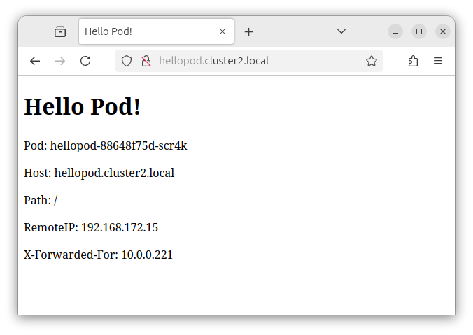

# hellopod
A hello world web app for running in kubernetes pods

## Overview

This is a simple web server that echoes basic information that comes in a HTTP request back to the HTTP response:



## Docker image

This app is available as a docker image hosted on Github Container Registry:

```
docker pull ghcr.io/msound/hellopod
```

## Kubernetes Manifests

Some example manifests to deploy this app, setup service and ingress can be found in the [k8s](k8s/) directory.
